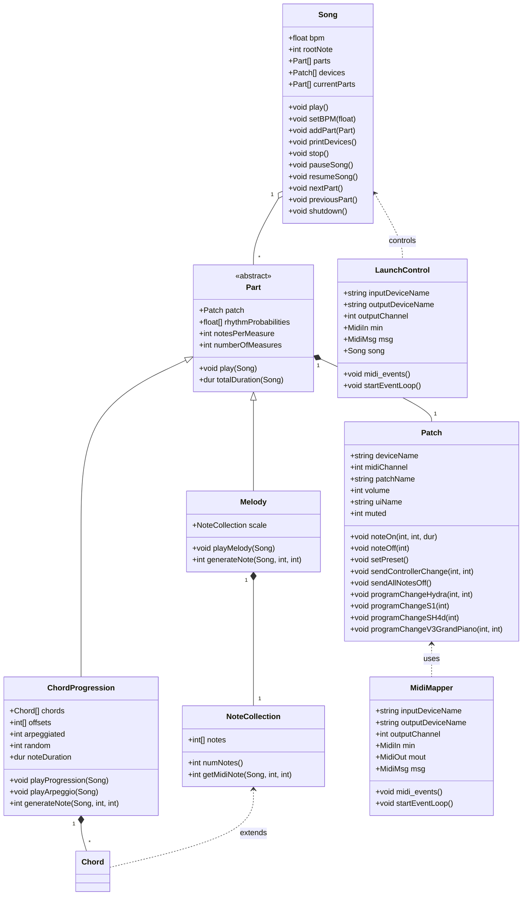

```mermaid
classDiagram
    class Song {
        +float bpm
        +int rootNote
        +Part[] parts
        +Patch[] devices
        +Part[] currentParts
        +void play()
        +void setBPM(float)
        +void addPart(Part)
        +void printDevices()
        +void stop()
        +void pauseSong()
        +void resumeSong()
        +void nextPart()
        +void previousPart()
        +void shutdown()
    }
    class Part {
        <<abstract>>
        +Patch patch
        +float[] rhythmProbabilities
        +int notesPerMeasure
        +int numberOfMeasures
        +void play(Song)
        +dur totalDuration(Song)
    }
    class ChordProgression {
        +Chord[] chords
        +int[] offsets
        +int arpeggiated
        +int random
        +dur noteDuration
        +void playProgression(Song)
        +void playArpeggio(Song)
        +int generateNote(Song, int, int)
    }
    class Melody {
        +NoteCollection scale
        +void playMelody(Song)
        +int generateNote(Song, int, int)
    }
    class Patch {
        +string deviceName
        +int midiChannel
        +string patchName
        +int volume
        +string uiName
        +int muted
        +void noteOn(int, int, dur)
        +void noteOff(int)
        +void setPreset()
        +void sendControllerChange(int, int)
        +void sendAllNotesOff()
        +void programChangeHydra(int, int)
        +void programChangeS1(int)
        +void programChangeSH4d(int)
        +void programChangeV3GrandPiano(int, int)
    }
    class NoteCollection {
        +int[] notes
        +int numNotes()
        +int getMidiNote(Song, int, int)
    }
    class MidiMapper {
        +string inputDeviceName
        +string outputDeviceName
        +int outputChannel
        +MidiIn min
        +MidiOut mout
        +MidiMsg msg
        +void midi_events()
        +void startEventLoop()
    }
    class LaunchControl {
        +string inputDeviceName
        +string outputDeviceName
        +int outputChannel
        +MidiIn min
        +MidiMsg msg
        +Song song
        +void midi_events()
        +void startEventLoop()
    }

    Song "1" o-- "*" Part
    Part <|-- ChordProgression
    Part <|-- Melody
    Part "1" *-- "1" Patch
    ChordProgression "1" *-- "*" Chord
    Melody "1" *-- "1" NoteCollection
    Patch <.. MidiMapper : uses
    NoteCollection <.. Chord : extends
    Song <.. LaunchControl : controls
```
