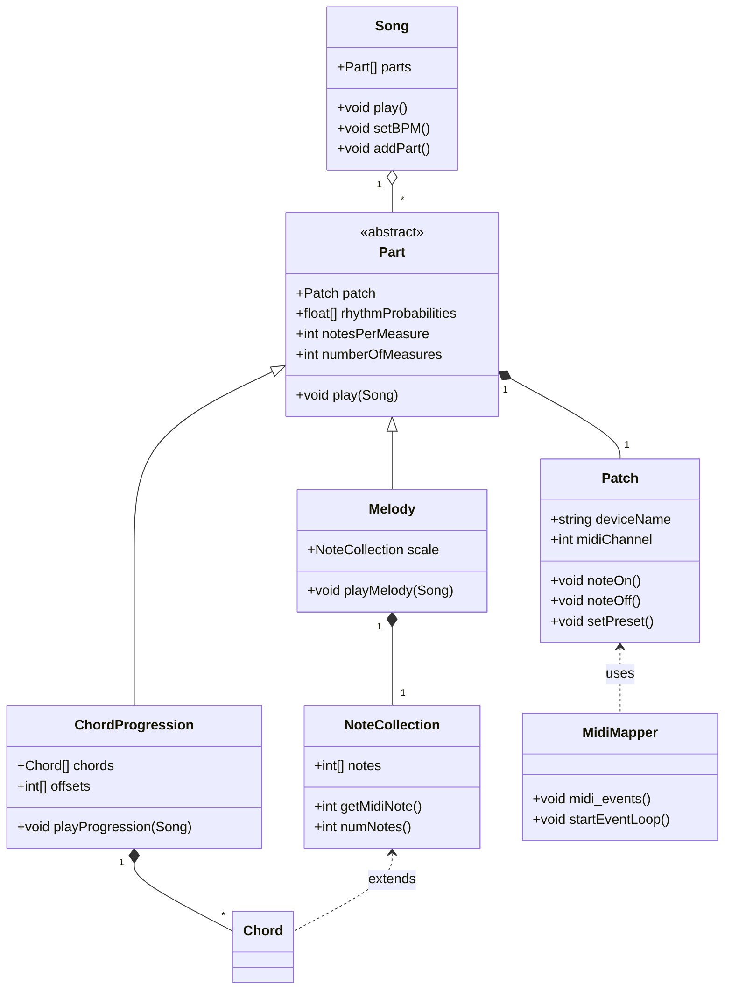

```mermaid
classDiagram
    class Song {
        +Part[] parts
        +void play()
        +void setBPM()
        +void addPart()
    }
    class Part {
        <<abstract>>
        +Patch patch
        +float[] rhythmProbabilities
        +int notesPerMeasure
        +int numberOfMeasures
        +void play(Song)
    }
    class ChordProgression {
        +Chord[] chords
        +int[] offsets
        +void playProgression(Song)
    }
    class Melody {
        +NoteCollection scale
        +void playMelody(Song)
    }
    class Patch {
        +string deviceName
        +int midiChannel
        +void noteOn()
        +void noteOff()
        +void setPreset()
    }
    class NoteCollection {
        +int[] notes
        +int getMidiNote()
        +int numNotes()
    }
    class MidiMapper {
        +void midi_events()
        +void startEventLoop()
    }

    Song "1" o-- "*" Part
    Part <|-- ChordProgression
    Part <|-- Melody
    Part "1" *-- "1" Patch
    ChordProgression "1" *-- "*" Chord
    Melody "1" *-- "1" NoteCollection
    Patch <.. MidiMapper : uses
    NoteCollection <.. Chord : extends
```
